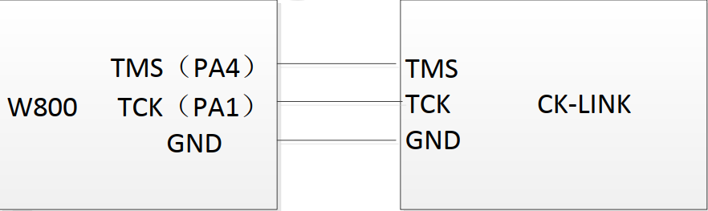
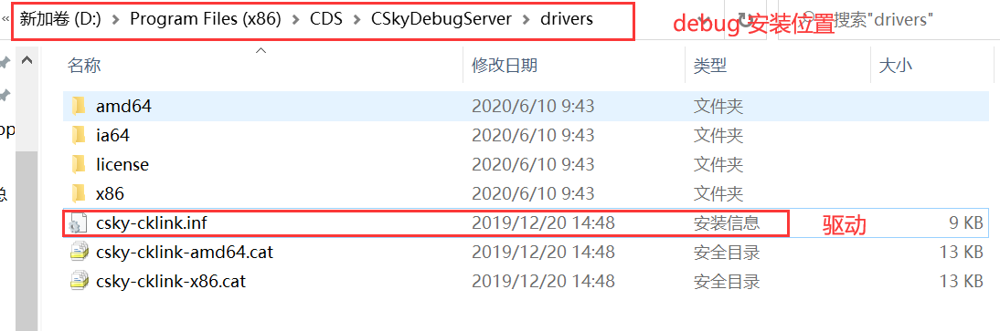
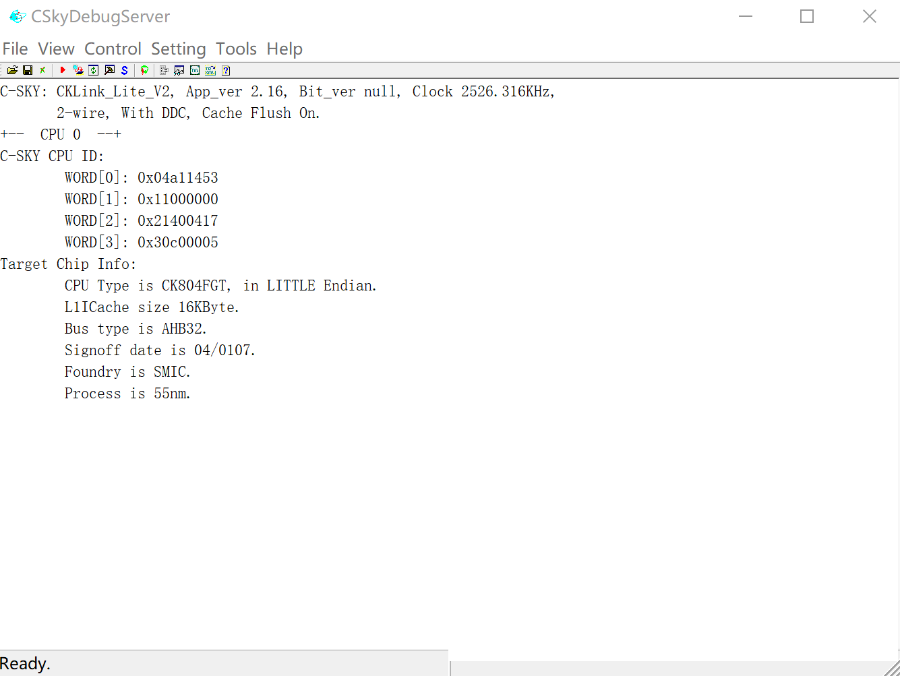
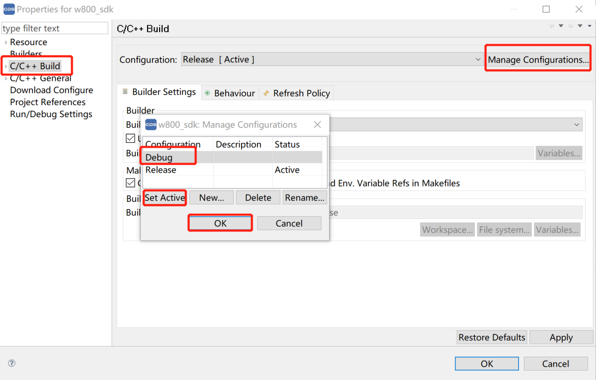
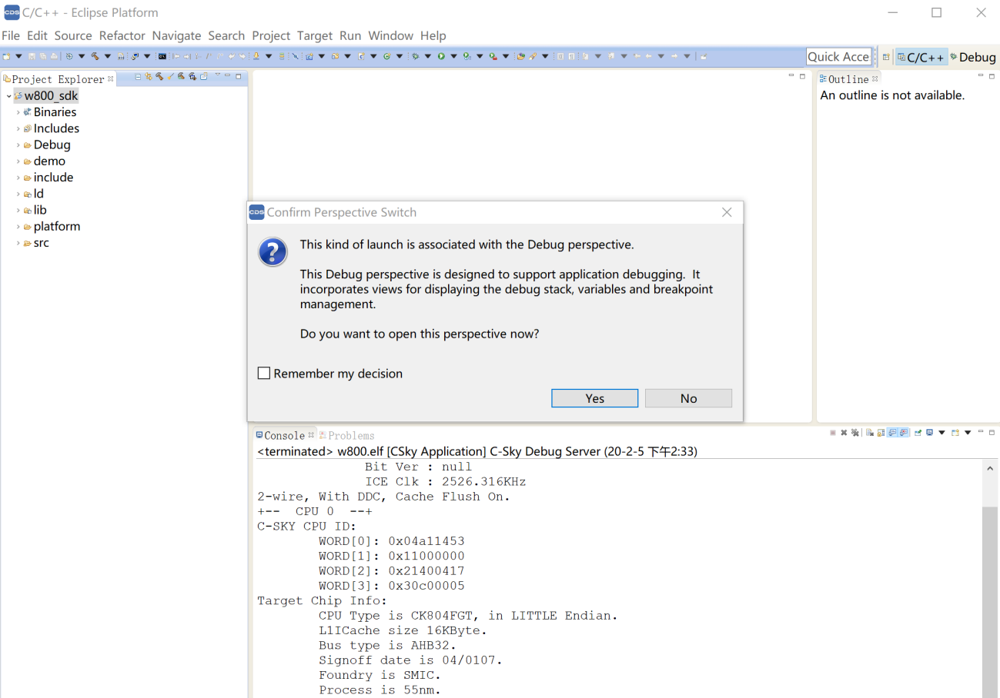

# W600 开发环境搭建指南

本文档旨在指导用户创建 W600 的软件环境。本文将通过一个简单的例子来说明如何使用 W600 进行应用开发，包括环境配置、程序编译、固件下载等步骤。

## **1 概述**

W600是联盛德新一代支持多接口、多协议的无线局域网802.11n（1T1R）低功耗 WLAN SoC 芯片。芯片内置 Cortex-M3 CPU处理器和Flash，集成射频收发前端RF Transceiver，CMOS PA功率放大器，基带处理器/媒体访问控制，集成电源管理电路，支持丰富的外围接口， 支持多种加解密协议。W600提供给客户的二次开发空间更大、芯片外围电路器件更少、开发更简便，性价比更优势。

W600芯片只有5mm x 5mm 大小，但集成度非常高。芯片内部集成了 RF Switch、Balun、低噪声放大器、滤波器、功率放大器、电源管理模块等，此外还内置了1MByte Flash，使得芯片外围电路器件更少，且模块体积更小、成本更优。W600不仅提供了更加丰富的接口和更大的内存空间，还集成了各种加解密硬件加速器，可提供更快的加解密算法执行速度。芯片采用业界通用的 Cortex-M3 处理器，代码可移植性更强、开发环境友善。

## **2 准备工作**

**·** **电脑**: 开发环境支持Keil 和GCC

**·** **SDK**: [W600 最新SDK](https://github.com/w600/sdk)

**·** **keil工具链**: MDK （Keil 开发）

**·** **gcc开发环境**: [eclipse + cygwin+ gcc](https://eyun.baidu.com/s/3ghjX5xL)

**·** **TB-01 开发板**（[购买链接](http://shop.thingsturn.com/)）

**·** **Micro USB 线**（需支持数据传输）

## **3 开发板介绍**

TB-01 是一款基于联盛德 W600 的超小体积核心开发板，该开发板引出了芯片的所有IO，并且内置LDO和UART传输芯片，只需一根 Micro USB 数据线与电脑连接即可使用，支持一键下载，外设拥有5个环形LED和2颗按键，调试操作极其方便。

## **4 KEil 环境搭建**

### **4.1 安装MDK 环境搭建**

由于 SDK 需要 Cortex-M3 的 Device Pack 支持，如果在线下载速度较慢 或 安装遇到问题，建议安装 [MDK 5](https://www.keil.com/download/product/) 的同时也安装对应的 [Legacy 版本](http://www.keil.com/mdk5/legacy/)

### **4.2 打开工程**

打开下载的SDK工程，找到 **\SDK\Tools\Keil\Project\WM\_W600.uvproj** 文件并打开

注意：若提示工程打开失败，请检查 MDK 是否按照上一章节进行正确配置

### **4.3 修改 Demo 示例**

找到main.c，此处的 void UserMain(void) 是用户程序的函数入口

修改 SDK 打印信息

### **4.4 编译**

点击菜单栏可进行编译

控制台窗口输出如下：

## **5.GCC环境搭建**

### **5.1 安装**

双击下载的 W600_IDE_Setup.exe ,如图，自行选择要解压的目录；

解压后的目录如下

### **5.2 配置**

1.  点击 **ConfigTool.exe** 弹出配置界面；

2.  点击 Default 按键，自动搜寻Eclipse Path 和 Cygwin Path路径；

3.  点击 Register 注册 cygwin；

4.  点击保存，使配置生效。可以在任何目录下，右键打开cygwin命令框。

### **5.3 导入新工程**

双击 **IDE.exe** 打开IDE应用程序, IDE内置了一份W600的SDK，不是最新版本，建议更新

1.  点击 **file-> import**

2.  点击 **C/C++**，选择 **Existing Code as Makefile Project**

3.  去除 **C++** 支持，选择 **Cygwin GCC** ; 点击 **Browser** , 选中我们之前下载好的SDK工程

4.  点击Finish完成工程的导入

### **5.4 编译**

右键需要编译的工程,点击 **Clean project**, 清除完后再右键工程，点击 **Build Project** 即可，出现 Build fininsh！则编译正常无误，可以烧录固件。

 

## **6.固件烧录与调试**

**注意：由于我们在硬件上将 W600 的 RESET 引脚和串口芯片的 RTS 引脚连接在了一起，当您在使用其它串口工具（如 SecureCRT）时，需要去掉开发板上面的 R100 电阻，否则串口可能会无输出。**

固件烧录和调试需依赖[星通智联串口调试助手](https://docs.w600.fun/?p=tools/serial.md)

### **6.1 连接设备**

1. 将开发板与电脑通过 Micro USB 线进行连接
2.  打开星通智联串口调试助手
3. 打开对应的串口，并点击 **复位设备**(或按下 RST 按键) 进行设备复位
4. 串口打印信息如下，说明开发板正常工作

**如有异常，请参考以下方法进行检查**

* 检查拔插设备时**设备管理器**是否有变化（变化部分为串口），并检查 [串口驱动](http://wch.cn/downloads/file/65.html) 是否安装成功；
* 若未能发现新增串口，请尝试更换一根 Micro USB 数据线；
* 出现其它打印信息内容或者乱码，请联系对应的销售人员或技术支持人员；

### **6.2 固件烧录及运行**

1. 选择对应的固件，支持 FLS 和 img 格式；FLS 是 WM_W600_sec.img + secboot.img 的合并文件，一般用于芯片的首次下载，之后仅烧录 WM_W600_SEC.img即可。

2.  点击“下载”进行固件下载，波特率默认使用 115200 bps，支持 2Mbps！； 烧录遇到问题的用户请参考:[W600固件烧录指南](https://docs.w600.fun/?p=app/download.md)

3.  观察固件运行信息

 

### **结束**

恭喜！你已完成 W600的入门！

现在你可以尝试其他的示例工程或者直接开发自己的应用程序。

# W800 开发环境搭建指南

本文档旨在指导用户创建 W800 的软件环境。本文将通过一个简单的例子来说明如何使用 W800 进行应用开发，包括环境配置、程序编译、固件下载、在线调试等步骤。

## **1 概述**

W800 芯片是一款安全 IoT Wi-Fi/蓝牙 双模 SoC 芯片。支持 2.4G IEEE802.11b/g/n Wi-Fi 通讯协议；
支持 BT/BLE 双模工作模式，支持 BT/BLE4.2 协议。芯片集成 32 位 CPU 处理器，内置 UART、 GPIO、 SPI、
I2C、 I2S、 7816 等数字接口；支持多种硬件加解密算法，内置 DSP、浮点运算单元与安全引擎，支持代码安
全权限设置， 内置 2MBFlash 存储器， 支持固件加密存储、固件签名、安全调试、安全升级等多项安全措
施，保证产品安全特性。 适用于用于智能家电、智能家居、智能玩具、无线音视频、工业控制、医疗监护
等广泛的物联网领域

## **2 准备工作**

**·** **电脑**: 开发环境支持CDS 集成开发环境  

**·** **SDK**: [W800 最新SDK](https://github.com/glorious-su/W800/tree/master/zh)

**·** CDS工具链:Simple版本集成ELF工具链 

​                      Full版本集成ELF和LINUX工具链

**·** **TB-08 开发板**（~~[购买链接](http://shop.thingsturn.com/)~~）

**·** **Micro USB 线**（需支持数据传输）

## **3 开发板介绍**

TB-08 是一款基于联盛德 W800 的超小体积核心开发板，该开发板引出了芯片的所有IO，并且内置LDO和UART传输芯片，只需一根 Micro USB 数据线与电脑连接即可使用，支持一键下载，外设拥有5个环形LED和2颗按键，调试操作极其方便。

## **4 开发环境搭建**

### 4.1 安装CDS

在官网 https://occ.t-head.cn 平头哥芯片开放社区-技术部落-资源下载中可以找到 CDS 集成
开发环境下载链接，下载 CDS 安装包之后，双击压缩包中的 setup.exe 即可启动安装。

   

安装中需要用户输入一些信息，根据界面提示输入即可：  

 

 

最后，点击 next 启动安装：  

 

 

### 4.2 导入工程

双击图标启动后将工程操作导入到 CDS 中：  

 

 

完成之后，导入的工程出现在工程管理视图中，如下图所示。  

## 5 编译 SDK

导入 SDK 工程之后，在左侧工程管理视图中右键单击工程，选择 Build Project 开始编译：  

在 CDS 的 Console 窗口会输出编译信息，如果有错误也会在 Problems 中显示，可以根据提示自行修改。  

 

## 6 下载固件

W800 可以使用多种方式下载固件，这里仅以集成 wm_tool 工具下载举例。
首先右键工程依次选择“Make Targets” → “Create…”：  

 

在弹出的对话框中按照下图进行设置：  

“Target name”输入“download”；
“Make Target”输入“download DL_PORT=串口号”，如 COM18；
“Build Command”输入“make -f ${project_loc}\..\..\..\..\utilities\download.mk”；
这几条配置，除了串口号用户按需修改之外，其余建议用户直接复制粘贴，填完点击 OK 按钮。
然后右键工程依次选择“Make Targets” → “Build…”：  

 

在弹出的对话框中选中刚才配好的“download”项目，点击“Edit…”按钮：  

 

这时弹出对话框如下图：  

 

直接点击 OK 按钮返回即可。  

 

此时，选中刚才配好的“download”项目，点击“Build”按钮即可开始下载固件：  

 

下载过程中，有可能需要用户手动复位开发板，请按照 Console 窗口中的提示信息操作即可。至此，固件的编译和烧录已经成功  

## 7 在线调试  

### 7.1 安装 Debug Server

在官网 https://occ.t-head.cn 平头哥芯片开放社区-技术部落-资源下载中可以找到 Debug
Server 下载链接，下载 Debug Server 安装包之后， Windows 系统下双击压缩包中的 setup.exe
即可启动安装， Linux 系统下执行压缩包中的安装脚本即可启动安装。
注意： Windows 系统下安装 CDS 集成开发环境的话是可选安装 Debug Server 的。（安装CSD时选择了debug sever可跳过此安装环节）  

安装中需要用户输入一些信息，根据界面提示输入即可：  

最后，点击 next 启动安装：  

然后请耐心等待安装完成。  

### 7.2 连接 CK-LINK

先使用杜邦线连接CK-LINK和W800模块，其连接方式如下图：  

打开上述路径打开软件安装位置，双击安装驱动

然后模块供电，并将 CK-LINK 和电脑连接，驱动文件安装正确的话， CK-LINK 的指示灯将会由红色变为黄色。

注意：

要使用调试功能， 需要配置 PA1 和 PA4 的 IO 的复用为调试功能， SDK 里把宏 WM_SWD_ENABLE 置为 1

后编译版本，烧录到板子后即可使用调试器。  

5  s双击桌面图标启动之后，界面会如下显示：

  

第一行会显示 CK-LINK 的版本等信息，如果驱动未安装成功这行信息不会出现；
后面几行显示了 CPU 等芯片信息，如果接线不正确这些信息也不会显示。
当显示无误之后，说明环境已经就绪，此时可以关闭此程序，请阅读下文使用 CDS 集成环境进行调试。  

### 7.3 使用 CDS 集成环境在线调试程序  

6.1 配置工程
导入 SDK 工程之后，在左侧工程管理视图中右键单击工程，如下图选择设置：  

6.2 启动调试  

右键工程选择如下：  

之后根据界面提示操作即可。  

## 8 结束

恭喜！你已完成 W800的环境搭建、程序编译、一种固件下载、在线调试等步骤。

现在你可以尝试其他的示例工程或者直接开发自己的应用程序。