# 联盛德 AT 指令

本文旨在引导客户使用W600系列产品编译和下载调试联盛德版本的AT固件，其中包括硬件环境，软件环境，下载固件，调制等步骤。

## 介绍

该版本为联盛德实现的AT固件，需注意，和兼容版的指令是不同的，sdk默认编译的固件已经开启AT功能，用户可以根据自身需要打开和关闭该AT指令功能

## 准备工作

- 电脑：固件下载当前仅支持Windows操作系统
- 软件：[串口调试助手](https://download.w600.fun/tool/%E6%98%9F%E9%80%9A%E6%99%BA%E8%81%94%E4%B8%B2%E5%8F%A3%E8%B0%83%E8%AF%95%E4%B8%8B%E8%BD%BD%E5%8A%A9%E6%89%8B.7z)
- 固件：[联盛德AT固件](https://download.w600.fun/firmware/at.fls)
- 硬件：TB-01开发板 或 W600系列模组，开发板（[购买链接](http://shop.thingsturn.com)）
- Micro USB线
- 文档：[WM_AT指令集手册](https://download.w600.fun/document/W60X_SDK_AT%E6%8C%87%E4%BB%A4%E7%94%A8%E6%88%B7%E6%89%8B%E5%86%8C.pdf)

## 步骤

- SDK中AT指令实现代码全部开源，用户也可以基于需求开发自己的AT指令
- 通过修改sdk->include->wm_config.h下的宏定义可以开启AT指令功能

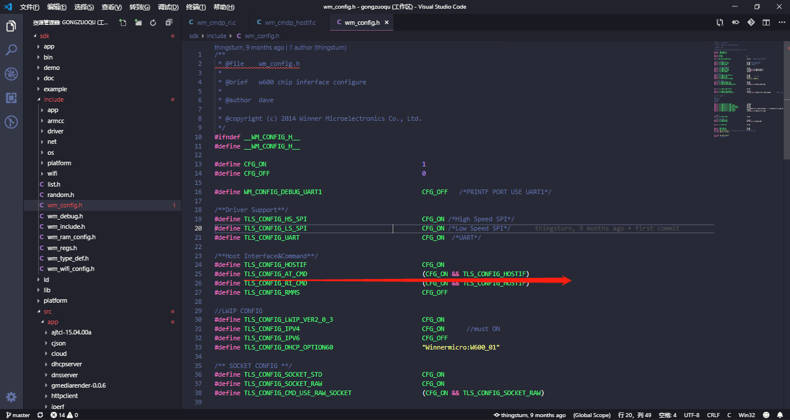

- AT代码实现位于sdk->src->app->wm_atcmd目录下

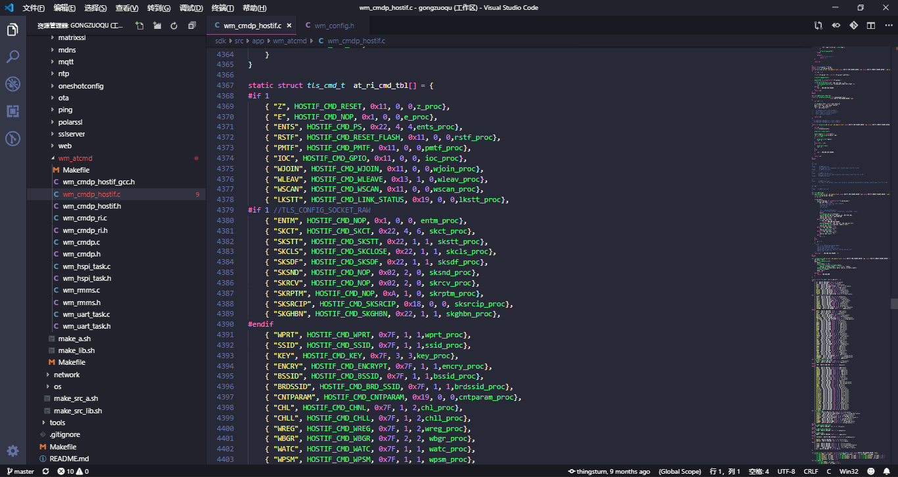

## 常见问题

- 模块出厂默认会烧录兼容版本AT固件，如需使用联盛德版本AT固件和自己修改可以另外烧录联盛德版本AT固件
- 如果修改过AT指令部分源码，编译时注意直接编译源码或者重新编译源码重新生成库文件，通过修改Makefile文件下的USE_LIB=0可直接编译源码生成固件

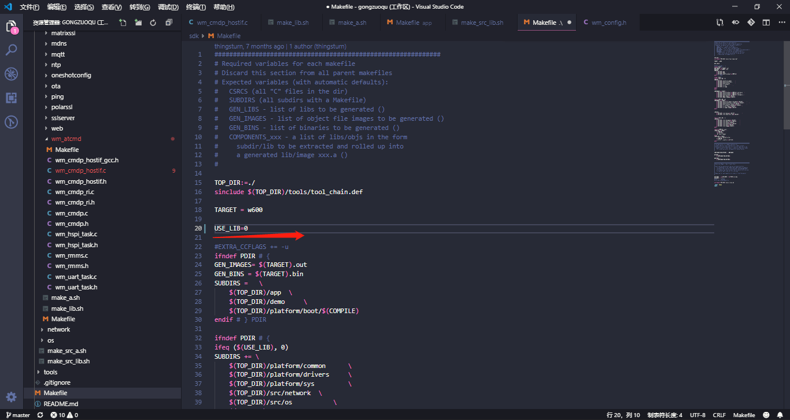

## 参考示例

### 1.1 创建 *SoftAP* 流程

（ 1） WPRT 设置无线网卡工作模式为  SoftAP.

AT+WPRT=2

*参数 :  0：infra 网络（STA 模式）*2：infra 网络（SoftAP 模式）*3 ：infra 网络（APSTA 模式）*

（ 2） APSSID      设置无线网卡对于 STA 的网络名称 MyApCC

AT+APSSID=” MyApCC”

（ 3） APENCRY   设置无线网卡安全模式为 WEP64

AT+APENCRY=1

*参数：  0*: open; *1 :WEP64;*   *2: WEP128*;  *3: WPA-PSK(TKIP);* 4: WPA-PSK(CCMP/AES);

5: WPA2-PS0K(TKIP)

（ 4） APKEY         设置无线网卡密钥 12345

AT+APKEY=1,1,”12345”

*参数 1：密钥格式， 0 表示 HEX， 1 表示 ASCII*

*参数 2： index: 密钥索引号， 1～4用于WEP加密密钥，其它加密方式固定为0*

*参数 3：无线密钥。例如： 12345*

（ 5） APNIP         设置 ip 地址和子网掩码

AT+APNIP=1,”192.168.1.1”,”255.255.255.0”,”192.168.1.1”,”192.168
.1.1”

*参数 1：地址类型， 0 表示使用 DHCP 动态分配， 1 表示静态地址*
*参数 2： ip:192.168.1.1*
*参数 3： netmask： 255.255.255.0*
*参数 4： gateway： 192.168.1.1*
*参数 5： dns： 192.168.1.1*

（ 6）BRDSSID    SoftAP 模式 SSID 广播使能  

AT+BRDSSID=  1

*参数：   禁止：0        ，     使能：1zz*

(7) Z                        复位无线网卡

 AT+Z

（ 8） PMTF          保存参数到 spi flash

AT+PMTF

（ 9）WJOIN         创建无线网络 MyApCC

AT+WJOIN    

（ 10）等待一秒 1 秒

（11）电脑搜索到ap信号

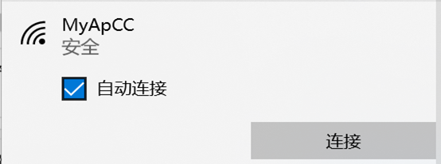 

（12） SLIST命令 查询 SoftAP 连接的 STA 信息

AT+SLIST   串口调试助手打印出连接信息

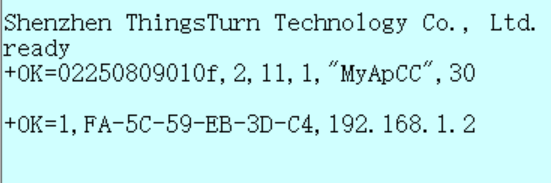 

（13） APLKSTT    查看当前 SoftAP 状态、

  AT+APLKSTT  

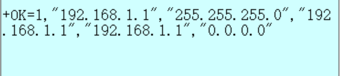 

### 1.2 STA 加入 AP 流程  

（1） 打开回显 AT+E

（2）WPRT             设置工作模式为 STA 

 AT+WPRT=0 

（3） WSCAN         无线网卡扫描 AP 

AT+WSCAN   

（4）SSID               设置需要加入的 AP 名称如 ThingsTurn_Office(选择2.4GhzWIFI)

AT+SSID=ThingsTurn_2018

（5）KEY                 设置需要加入的 AP 的无线密钥thingsturn2018

AT+KEY=1,0,thingsturn2018

*参数 ：*

  *1：密钥格式， 0 表示 HEX， 1 表示 ASCII*

 *2： index: 密钥索引号， 1～4用于WEP加密密钥，其它加密方式固定为0*

*3：无线密钥。例如：thingsturn2018*

（6）NIP                 启用 DHCP

AT+NIP=0

*参数：0 ： 使用 DHCP 动态分配/使能 DHCP Server* *1  ： 使用静态 IP 地址/禁用 DHCP Server*

（7）PMTF             保存参数到 spi flash

AT+PMTF

（8） Z                    复位无线网卡

AT+Z

（ 9）等待 1 秒

（ 10）WJOIN         加入无线网络

AT+WJOIN    

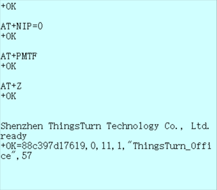 

​                             加入网络成功

（ 11）LKSTT         查看当前IP信息

AT+LKSTT  

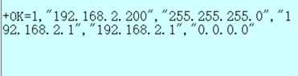    

​                              当前网络信息

（ 12）PING          启动 ping 程序进行网络测试

AT+PING=192.168.2.1,100,30,1

*参数：*

*1：对端的 ip 地址或者域名， ip 地址为点分十进制格式；*
*2： ping 程序发包的间隔，单位毫秒；*
*3： ping 程序发包次数， 0 表示持续发；*
*4： 1 表示启动 ping 测试， 0 表示停止 ping 测试。*

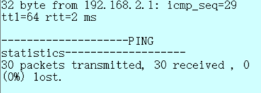 

​                          正常ping通网关30次

### 1.3 创建 APSTA 流程   

（1） 打开回显 AT+E

（2）WPRT                  设置工作模式为 APSTA   

 AT+WPRT=3  

（3）SSID                    设置需要加入的 AP 名称如 ThingsTurn_Office(选择2.4GhzWIFI)

AT+SSID=ThingsTurn_2018

（4）KEY                     设置需要加入的 AP 的无线密钥thingsturn2018

AT+KEY=1,0,thingsturn2018

*参数 ：*

  *1：密钥格式， 0 表示 HEX， 1 表示 ASCII*

 *2： index: 密钥索引号， 1～4用于WEP加密密钥，其它加密方式固定为0*

*3：无线密钥。例如：thingsturn2018*

（5）APSSID                设置无线网卡对于 STA 的网络名称 MyApCC

AT+APSSID= MyApCC

（6） APENCRY           设置无线网卡安全模式为WPA2-PS0K(TKIP)

AT+APENCRY=5

*参数：  0*: open; *1 :WEP64;*   *2: WEP128*;  *3: WPA-PSK(TKIP);* 4: WPA-PSK(CCMP/AES);5: WPA2-PS0K(TKIP)

（7） APKEY                 设置无线网卡密钥 12345678

AT+APKEY=1,0,”12345678”

*参数 1：密钥格式， 0 表示 HEX， 1 表示 ASCII*

*参数 2： index: 密钥索引号， 1～4用于WEP加密密钥，其它加密方式固定为0*

*参数 3：无线密钥。例如： 12345*678

（8） APNIP                 设置 ip 地址和子网掩码

AT+APNIP=1,”192.168.1.1”,”255.255.255.0”,”192.168.1.1”,”192.168.1.1”

*参数 1：地址类型， 0 表示使用 DHCP 动态分配， 1 表示静态地址*
*参数 2： ip:192.168.1.1*
*参数 3： netmask： 255.255.255.0*
*参数 4： gateway： 192.168.1.1*
*参数 5： dns： 192.168.1.1*

（9）PMTF                  保存参数到 spi flash

AT+PMTF 

（10） Z                       复位无线网卡

AT+Z

（11）等待 1 秒

（12）WJOIN               创建及加入无线网络

AT+WJOIN    

​                                        创建成功后打印出OK信息，并检索到创建的WIFI字样

（13）LKSTT                查看sta当前状态

AT+LKSTT   

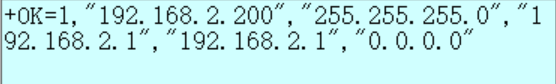 

​                                                   当前的STA状态

（14）APLKSTT            查看AP当前状态

AT+APLKSTT

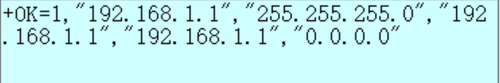 

​                                                   当前的AP状态

（15）PING             PING作为STA时的网关

AT+PING=192.168.2.1,100,30,1

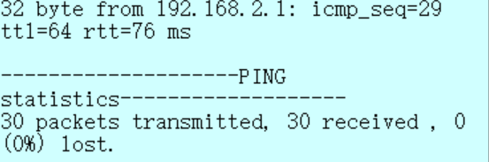 

（16）PING             PING作为AP时的网关

AT+PING=192.168.1.1,100,30,1

*参数：*

*1：对端的 ip 地址或者域名， ip 地址为点分十进制格式；*
*2： ping 程序发包的间隔，单位毫秒；*
*3： ping 程序发包次数， 0 表示持续发；*
*4： 1 表示启动 ping 测试， 0 表示停止 ping 测试。*

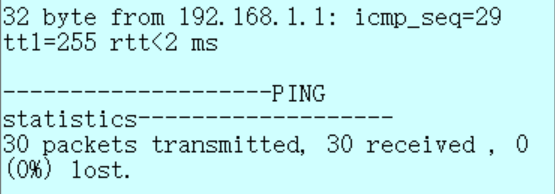 

（16）WLEAV        无线网卡断开 AP 

AT+WLEAV   

（17）WLEAV        SoftAP 断网

AT+WLEAV=2  

### 1.4 如何使用 Socket 功能     

#### 1.4.1  PC端的sever建立（net assist软件示例）

建立一个 PC 端的 TCP server，使用 net assist，选择 TCP server 地址为192.168.1.100，监听端口为 1000。  （此处的ip地址选择为本机的IP地址即可）

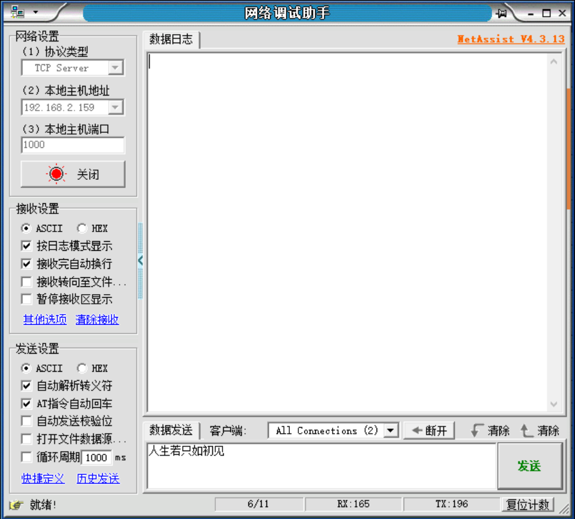

#### 1.4.2 调试串口端AT指令设置（以APSTA模式为例）

（1） 打开回显 AT+E

（2）WPRT                  设置工作模式为 APSTA   

 AT+WPRT=3  

（3）SSID                    设置需要加入的 AP 名称如 ThingsTurn_Office(选择2.4GhzWIFI)

AT+SSID=ThingsTurn_2018

（4）KEY                     设置需要加入的 AP 的无线密钥thingsturn2018

AT+KEY=1,0,thingsturn2018

*参数 ：*

  *1：密钥格式， 0 表示 HEX， 1 表示 ASCII*

 *2： index: 密钥索引号， 1～4用于WEP加密密钥，其它加密方式固定为0*

*3：无线密钥。例如：thingsturn2018*

（5）APSSID                设置无线网卡对于 STA 的网络名称 MyApCC

AT+APSSID= MyApCC

（6） APENCRY           设置无线网卡安全模式为WPA2-PS0K(TKIP)

AT+APENCRY=5

*参数：  0*: open; *1 :WEP64;*   *2: WEP128*;  *3: WPA-PSK(TKIP);* 4: WPA-PSK(CCMP/AES);5: WPA2-PS0K(TKIP)

（7） APKEY                 设置无线网卡密钥 12345678

AT+APKEY=1,0,”12345678”

*参数 1：密钥格式， 0 表示 HEX， 1 表示 ASCII*

*参数 2： index: 密钥索引号， 1～4用于WEP加密密钥，其它加密方式固定为0*

*参数 3：无线密钥。例如： 12345*678

（8） APNIP              设置 ip 地址和子网掩码

AT+APNIP=1,”192.168.1.1”,”255.255.255.0”,”192.168.1.1”,”192.168.1.1”

*参数 1：地址类型， 0 表示使用 DHCP 动态分配， 1 表示静态地址*
*参数 2： ip:192.168.1.1*
*参数 3： netmask： 255.255.255.0*
*参数 4： gateway： 192.168.1.1*
*参数 5： dns： 192.168.1.1*

（9）PMTF                保存参数到 spi flash

AT+PMTF 

（10） Z                     复位无线网卡

AT+Z

（11）等待 1 秒

（12）WJOIN            创建及加入无线网络

AT+WJOIN    

​                                           创建成功后打印出OK信息，并检索到创建的WIFI字样

（13）LKSTT           查看sta当前状态

AT+LKSTT  

 

​                                                        当前的STA状态

（14）APLKSTT      查看AP当前状态

AT+APLKSTT

 

​                                                        当前的AP状态

（15）PING             PING作为STA时的网关

AT+PING=192.168.2.1,100,30,1

 

（16）PING             PING作为AP时的网关

AT+PING=192.168.1.1,100,30,1

*参数：*

*1：对端的 ip 地址或者域名， ip 地址为点分十进制格式；*
*2： ping 程序发包的间隔，单位毫秒；*
*3： ping 程序发包次数， 0 表示持续发；*
*4： 1 表示启动 ping 测试， 0 表示停止 ping 测试。*

 

（16）SKCT            socket 的建立 指令（使用本命令前按照1.4.1配置好net assist才会返回socket号）

AT+SKCT=0,0,192.168.2.159,1000,8000

*参数 1：协议类型  ， 0 表示 TCP ， 1 表示 UDP*
*参数 2： C/S 模式  ,  0 表示 Client ， 1 表示 Server*
*参数 3： 目的服务器名称，可以输入域名或 ip 地址       此处为sever端IP地址，查看本机IP地址即 192.168.2.159* 
*参数 4：远程端口号  1000*
*参数 5： 本地端口号  8000*

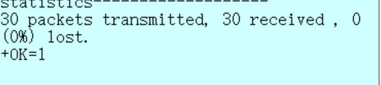 

​                                                       返回SOCKET号：1

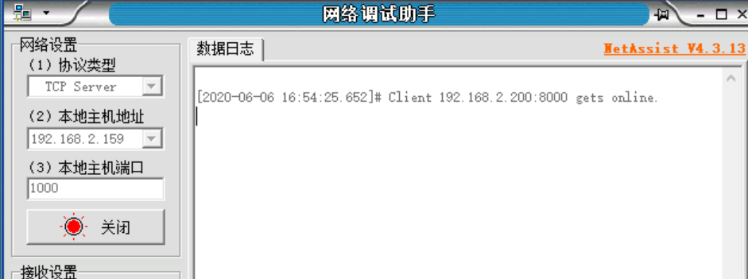  

​                                                                   net assist接收到在线的信息

（17）SKSND              socket 发送 指令

AT+SKSND=1，15

*参数 1：SOCKET号*
*参数 2： 发送的最大字节*

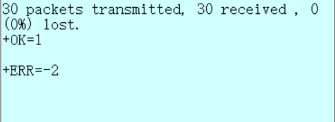

​     指令发送之后打印出如上命令则为**串口出错**，需要外接其他串口，此处使用的是串口1，默认的使用的是串口0，使用TTL转串口

此处为发送指令成功的打印信息。注意此处要选取相宜的发送字符数，否则会一直等待字符数相等时传输过去。发送字符串 “hello thingsturn”

​                                        此处为net assist软件收到的信息

（18）SKRCV             socket 接收指令

AT+SKRCV  =1，15

*参数 1：SOCKET号*
*参数 2： 接收的最大字节*

 

​                                                              net assist 发送字符

 

​               串口调试助手收到的数据，此时打印出实际传输的字符大小

（19）SKSTT                查询 Socket 状态指令

AT+SKSTT=1  

*返回的参数1：  socket 号*  

​           *参数2：   0：监听，1：监听，2，连接*

​           *参数3：  ip 地址*  

​           *参数4：  对端端口号*

​           *参数5：  本地端口号*    

​           *参数6：  接收 buffer 中数据长度。*  

（20）SKCLS                 关闭socket指令

AT+SKCLS=1  

*参数：1：为socket号*

### 2.1 使能蓝牙一键配网服务

2.1.1 开启蓝牙功能，使能配网服务
AT+BTEN=1,0 //使能蓝牙系统

*参数  1：串口索引号*

*参数  2：日志输出等级      0：关闭 log 输出*

​                                             *1：输出 error 级别的 log*

​                                             *2：输出 warn 级别的 log*

​                                             *3：输出 api 级别的 log*

​                                             *4：输出 event 级别的 log*

​                                             *5：输出 debug 级别的 log*

​                                             *6：输出 verbose 级别的 log*

*返回的参数 1：                 0：成功                1：失败*

​           *参数 2：              0：控制器停止    1: 控制器运行*

 

4.1.2AT+ONESHOT=4 //开启蓝牙配网服务
此时可以用 APP（**WMBleWiFi**）进行配网操作；注意配网成功后，系统会自动注销配网服务。

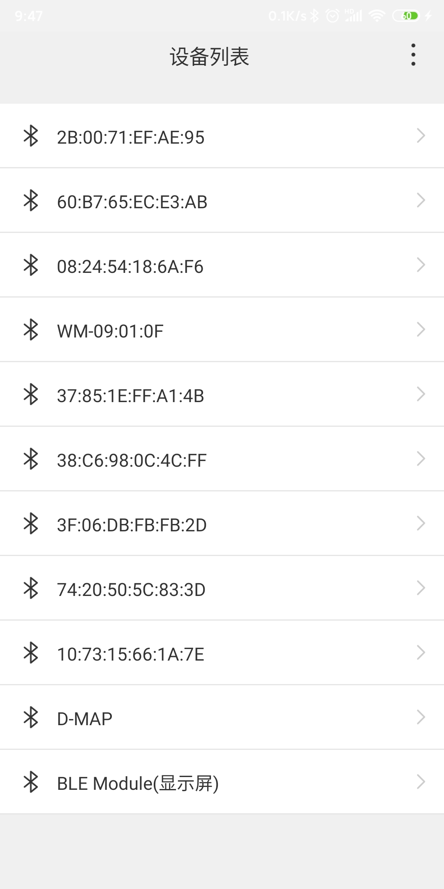 

​                                        选择为WM开头的蓝牙名称

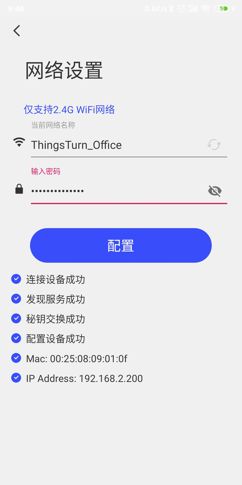 

​                         一键蓝牙配网成功后的界面，注意选择2.4GhWiFi

2.1.2 退出 WIFI 配网服务注销蓝牙系统 
AT+ONESHOT=0 //退出配网服务
AT+BTDES //退出蓝牙系统  

### 2.2 和手机端 Nrf connect APP 进行交互操作  

（ 1 ）使能蓝牙系统

 AT+BTEN=1,0

 

（ 2 ）创建 server

AT+BLECTSV=9999               //创建 uuid 为 9999 的 server  

*参数 1：uuid （唯一id）*    

*返回参数 1 ：指令执行结果， 0成功。其他，错误。*  

*返回参数 2 ：server接口索引号*  

*注意： w800 最多支持 7 个 gatt apps。这 7 个包括 server 和 client。目前分配情况为：*
*server 支持 3 个， client 支持 4 个。*  

 

（ 3 ）添加服务  

AT+BLEADDSC=4,1,1826,5 //添加 uuid 为 1826 的服务
                                              //1824uuid，为蓝牙配网专用。  

*参数 1： 创建server返回的接口号。*
*参数 2：inst_id：默认值是1。*
*参数 3：uuid： 此服务的uuid。*
*参数 4：num_handles：默认值是5。*

*返回参数 1：0成功。其他，错误。*

​       *参数 2 ：创建server返回的接口号*  

​       *参数 3 ：service_handle:该服务值的句柄*  

 

  ( 4 ）添加特征值
AT+BLEADDCH=4,40,2abc,28,11 //添加 uuid 为 2abc 的特性值  

*参数 1 ：server_if： 创建server返回的接口号。*

*参数 2 ：service_handle： 添加服务返回的句柄。*

*参数 3 ：uuid： 唯一id，取值格式不祥。*

*参数 4 ：properties： 加密授权描述， 16进制格式*

*参数 5 ：permissions： 读写属性,  16进制格式*

*返回参数 1：status: 指令执行结果， 0成功。其他，错误。*  

​                *2： server_if： 创建server返回的接口号。*

​                *3： service_handle： 添加服务返回的句柄。*

​                *4：char_handle*

 

  ( 5 ）添加特征值描述
AT+BLEADESC=4,40,2902,11 //添加 uuid 为 2902 的特性值描述  

*参数 1 ：server_if： 创建server返回的接口号。*

*参数 2 ：service_handle： 添加服务返回的句柄。*

*参数 3 ：uuid：此描述服务的uuid。*  

*参数 4 ：permissions： 读写属性*

*返回 参数 1：status: 指令执行结果， 0成功。其他，错误。*  

​        *参数 2 ：创建server返回的接口号。*

​        *参数 3 ：service_handle： 添加服务返回的句柄*

​        *参数 4 ：desc_handle:该描述服务的句柄。* 

 

  ( 6 ）开启服务
AT+BLESTTSC=4,40,2                //开启服务  

*参数 1 ：server_if： 创建server返回的接口号。*

*参数 2 ：service_handle： 添加服务返回的句柄。*

*参数 3 ：tran_type： BLE传输类型，默认值为2*  

*返回 参数 1：status: 指令执行结果， 0成功。其他，错误。*

​        *参数 2 ：创建server返回的接口号。*

​        *参数 3 ：service_handle： 添加服务返回的句柄*

 

  ( 7 ）开启广播
AT+BLEADATA=1,11223344  //设置广播内容,自动开启广播
                                                 //广播内容，包含设备名称，
                                                //FF 字段内容为 0x11223344

 

*参数 1 ：Include_name:1， 广播包内包含设备名称；否则不含名称*  

*参数 2 ：data： 广播内容， 该内容将以 FF 字段 paylaod 广播，为 HEX 格式。例如，设置广播数据为 0x11 0x22 0x33  0x44 0x55，则设置指令为： AT+BLEADVDATA=1122334455。*

  

手机端广播数据显示：打开Nrf connect APP--打开SCANNER--打开WM名称蓝牙--打开RAW  

  ( 8 ）手机开始扫描
Nrf connect 扫描结果：WM开头的蓝牙 

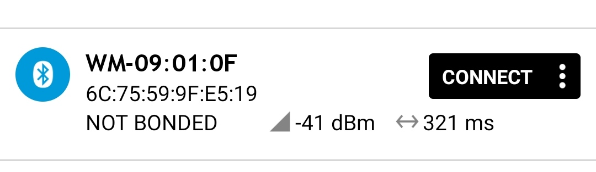 

  ( 9 ）手机侧发起连接
点击 CONNECT 按钮，此时 w800 会显示：   

即手机的 MAC 地址 578AECE2D226 连接成功。连接成功后，手机侧可以看到我
们创建的服务描述。
下图中， 1826 即为我们创建的服务  

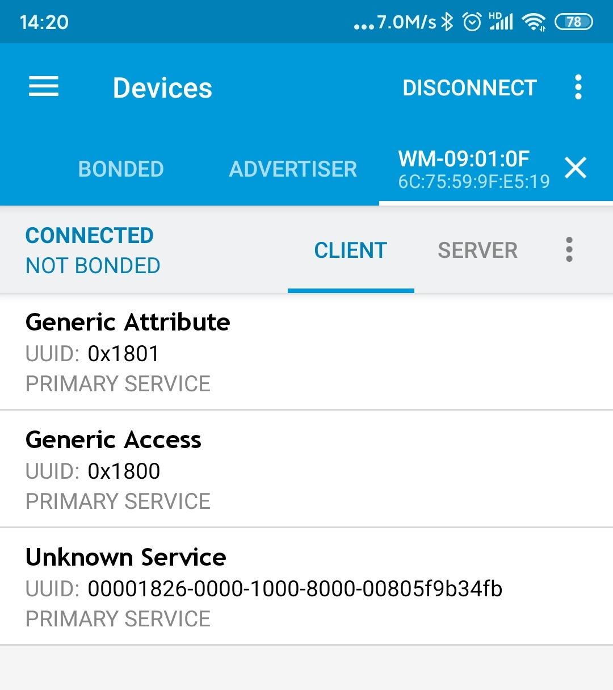 

单击 Transport Discovery 即可看到我们创建的特性值及描述  

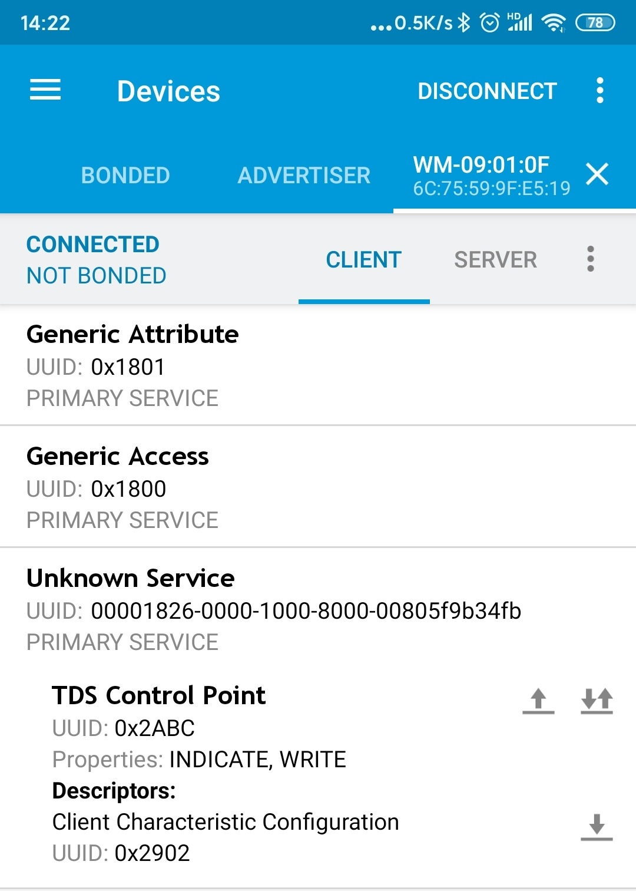 

 ( 10 ）手机侧使能 Indication 功能
点击 0x2abc 右侧的上下箭头，代表使能 indicate 操作，此后， W800 会每隔 2S 发
送字符串给手机，显示如下： BLE， 当前系统时间，下面显示的 HEX 格式  

 

​                                          串口打印出手机已经接收的信息

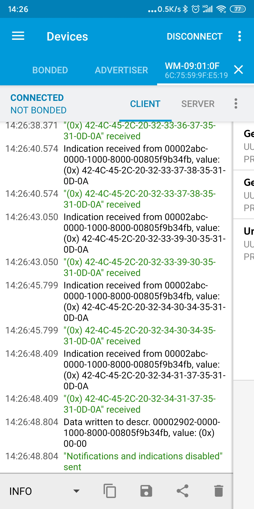 
        接收到HEX格式 *0D*表示回车 *0A*表示换行（显示界面在client页右划）

再次点击 0X2ABC 右侧的 上下箭头，此时形状为，代表停止 indication 发送  

 ( 11 ）手机侧写取特征值数据
点击 0X2ABC 右侧向上箭头，代表特性值写操作， W800 会将收到的内容返回回来  

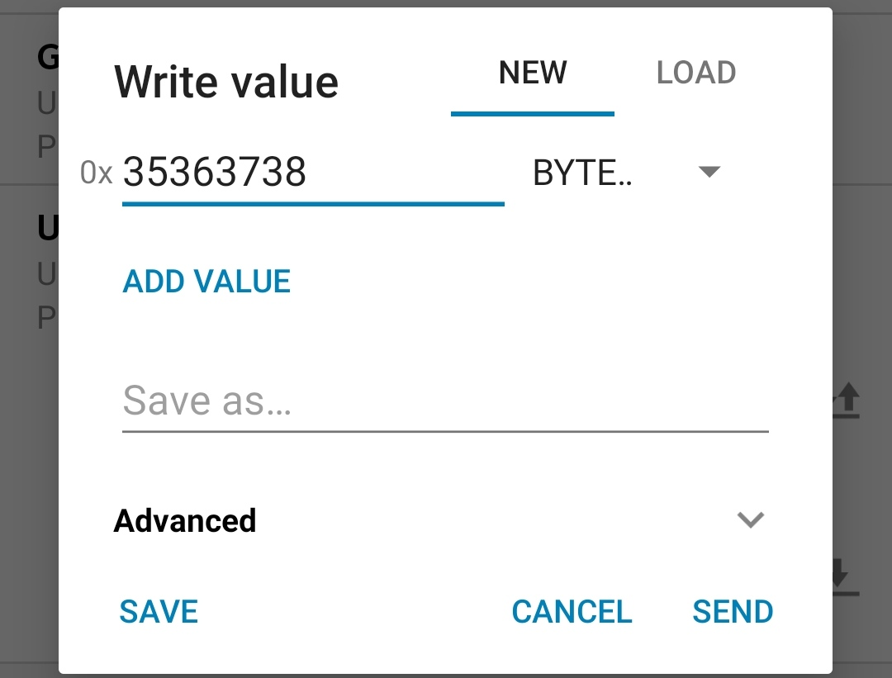 

APP 显示收到的返回值：  

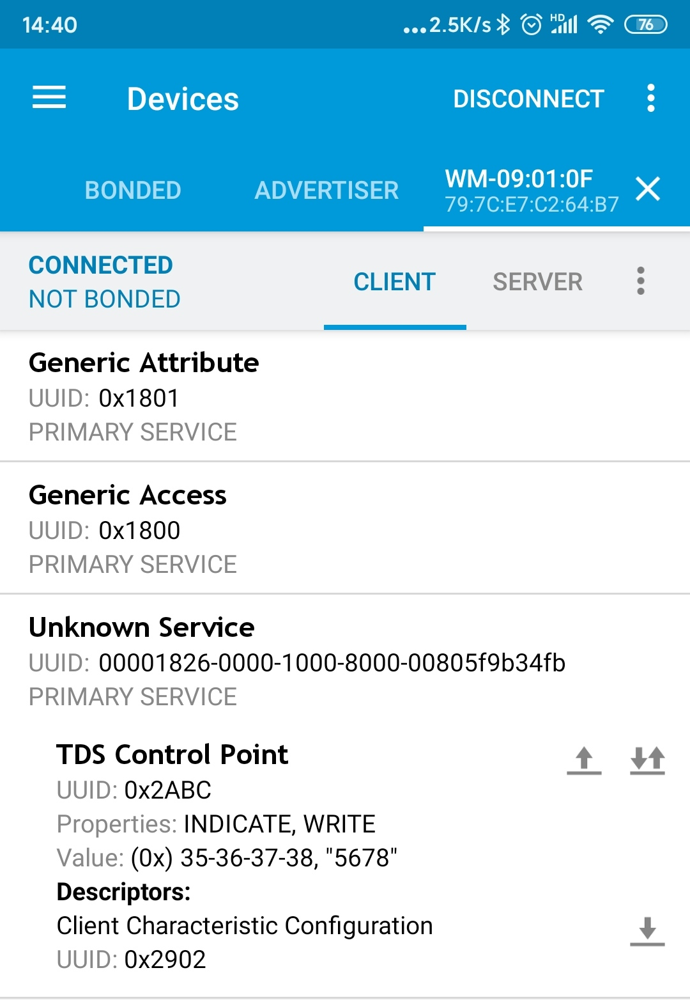 

此时 W800 侧会显示收到的内容：  

 

 ( 12 ）手机侧读取描述符
点击描述符右侧的读操作，向下的箭头，代表读取描述内容  

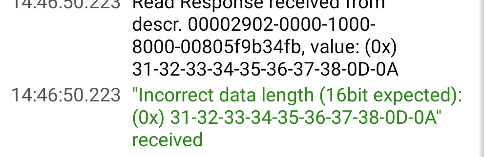      

​                   接收到HEX格式的12345678 *0D*表示回车 *0A*表示换行

 ( 13 ）停止服务
AT+BLESTPSC=4,40 //停止句柄为 40 的服务

  

 ( 14 ）删除服务
AT+BLEDELSC=4,40  

 

 ( 15 ）注销 server
AT+BLEDESSV=4 //注销 client_if 为 4 的 server  

 

 ( 16 ）注销蓝牙服务
AT+BTDES  

 

### 资源下载

[联盛德AT固件](https://download.w600.fun/firmware/at.fls)

