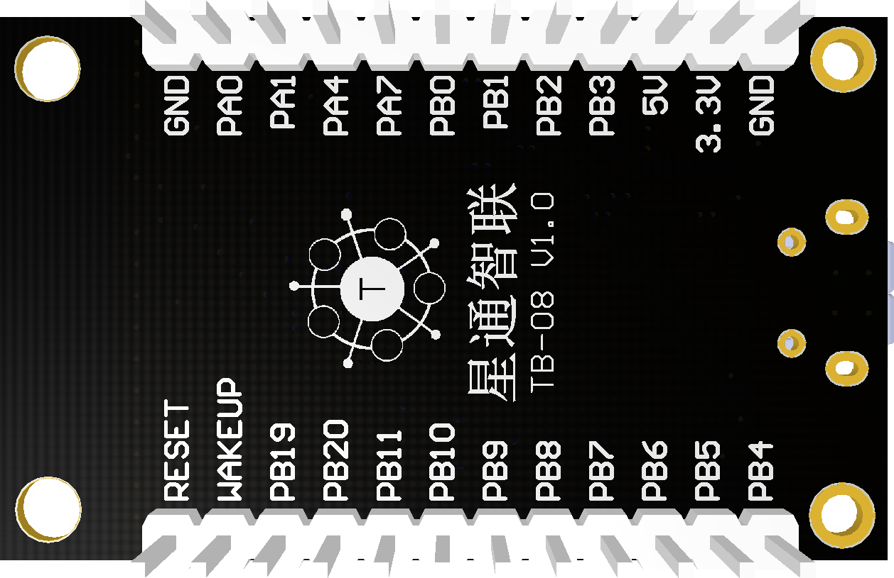
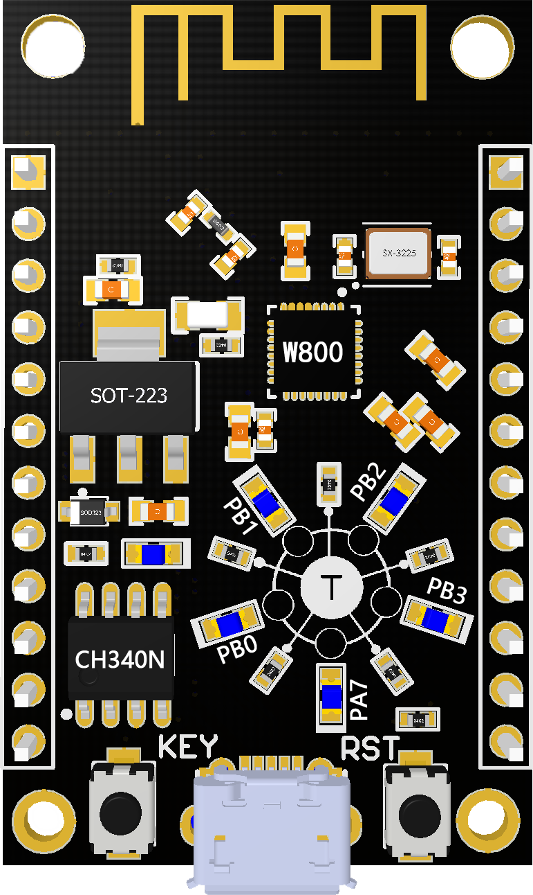
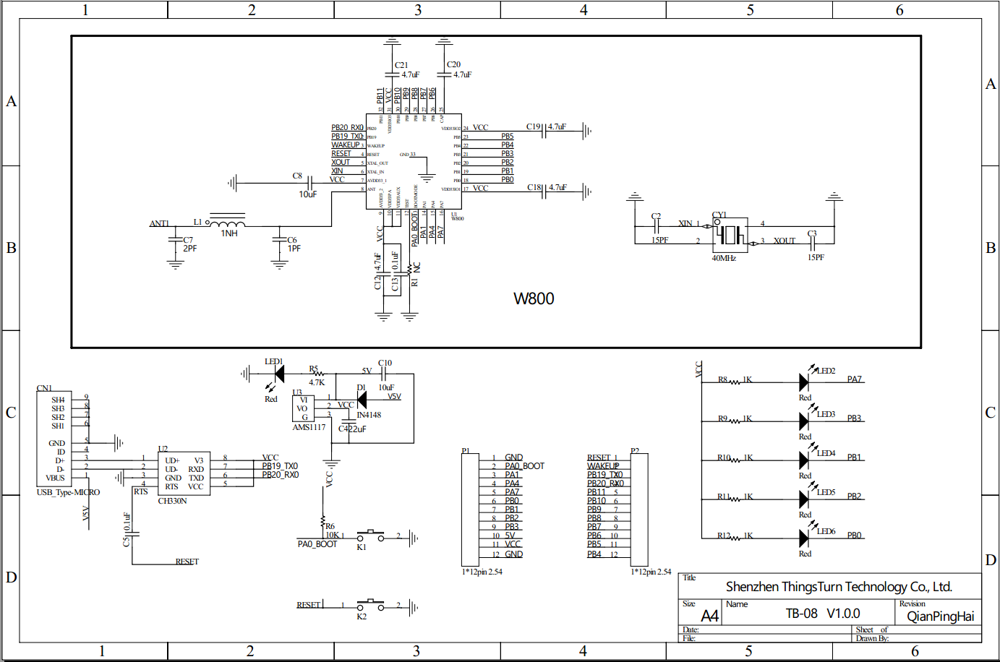

# TB-08 开发板

## 概述

TB-08 是一款基于联盛德 W800的超小体积核心开发板，该开发板引出了W800芯片的所有IO，并且内置LDO和UART传输芯片，只需一根Micro USB数据线与电脑连接即可使用，支持自动下载，外设拥有5个环形LED和1颗用户按键+1颗复位按键，调试操作极其方便。

## 引脚说明

## 外设说明

## 内部原理图

## 其他

硬件资料：https://github.com/thingsturn/tb-08-devkit
