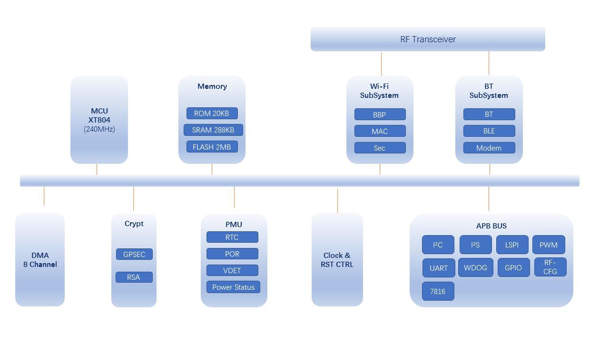
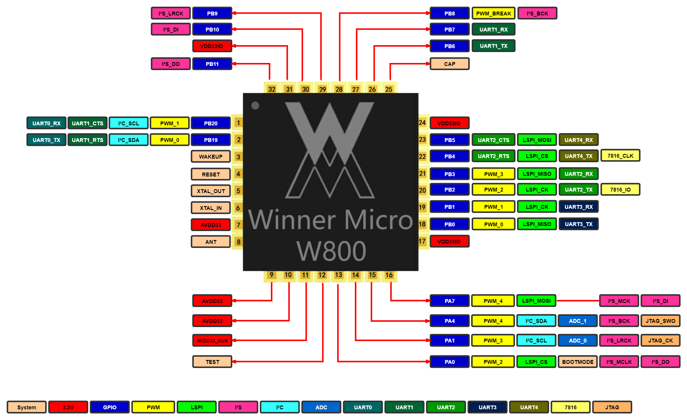

# W800 简介

W800是北京联盛德自主研发设计的一款安全 IoT Wi-Fi/蓝牙 双模 SoC芯片，该系列产品支持标准的2.4G IEEE802.11b/g/n Wi-Fi 通讯协议和 BT/BLE 4.2 双模蓝牙协议。

W800 集成32位高速处理器，内置UART、GPIO、SPI、I2C、I2S、7816等数字接口；支持多种硬件加解密算法，内置DSP、浮点运算单元与安全引擎，支持代码安全权限设置，内置2MBFlash存储器，支持固件加密存储、固件签名、安全调试、安全升级等多项安全措施，保证产品安全特性。

W800适用于用于智能家电、智能家居、智能玩具、无线音视频、工业控制、医疗监护等广泛的物联网领域。 

## W800 特性

1.  集成平头哥 32位 XT804处理器，工作频率240MHz，内置DSP、浮点运算单元与安全引擎；
2.  内置2MB Flash，288KB RAM；
3.  集成5路 UART 高速接口；
4.  集成2路16位 SD-ADC，最高采样率1KHz ；
5.  集成1个I2C控制器；
6.  集成5路PWM接口；
7.  集成1路 Duplex I2S控制器；
8.  具备固件加密功能，内置真随机数发生器以及各种常用硬件加密模块；
9.  支持BT/BLE 双模工作模式，支持BT/BLE4.2 协议；
10.  集成7816接口，支持EVM2000规范，并兼容串口功能。
11.  支持PS-Mode（Power Sleep）、Sleep 和 Standby 等低功耗模式，Standby 模式下功耗小于15uA；
12.  除射频外，其它资源代码完全开放；
13.  支持 GCC 开发和SWD在线调试。

## 引脚说明

## 资源下载

[W800_芯片产品规格书](https://download.w600.fun/document/W600_%E8%8A%AF%E7%89%87%E4%BA%A7%E5%93%81%E8%A7%84%E6%A0%BC%E4%B9%A6.pdf)
